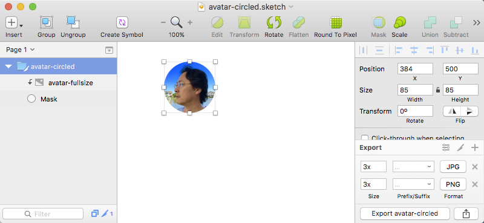

command line clipboard tool for macOS

## Usage Example

Starting with a Sketch file below with avatar object selected:



Copying to clipboard and running

	clipboard list

should output

```json
	["com.bohemiancoding.sketch.v3", "com.adobe.pdf", "Apple PDF pasteboard type",
	"public.tiff", "NeXT TIFF v4.0 pasteboard type", "com.facebook.semaphore",
	"public.utf8-plain-text", "NSStringPboardType", "dyn.ah62d4rv4gu8y4y4xsv6023nukm10c6xenv61a3k",
	"MSStylePBoardType", "dyn.ah62d4rv4gu8y4y4ftb2g86xym72hk4ptr33zauxtqf3gkzd3sbwu",
	"MSExportOptionsPBoardType"]
```

Let's get PDF version of clipboard data since SVG version is not available:

	clipboard get com.adobe.pdf > avatar-circled.pdf

Opening the output file `avatar-circled.pdf` shows:


## Commands

### list

Lists clipboard content types to standard output

	clipboard list

### get

Retrieve clipboard content of given type to standard output. Binary clipboard data is supported.

	clipboard get {data-type}

## TODO

* Windows and Linux versions
* Electron-compatible Node.js wrapper
* Add `set`, `add`, `remove`, `clear` commands
* Add `copy` and `paste` commands emulating `pbcopy` and `pbpaste` behavior
* Support input (`-i`) and output file (`-o`)
* Allow multi-type `get` and `set` using popular archive format (zip, gzip, and/or tar)

